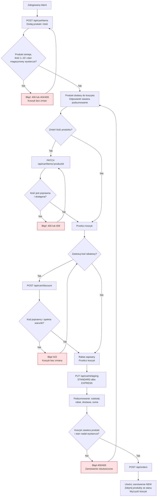

# Przepływ od dodania produktu do złożenia zamówienia

Diagram pokazuje główną ścieżkę klienta. Logowanie jest warunkiem wykonania operacji na koszyku i złożenia zamówienia.

## Uwagi dla testera

- **BR-03:** przy dodawaniu i zmianie ilości sprawdź limit 1–10 sztuk oraz stan magazynowy.
- **MOŻLIWY BŁĄD (BR-03):** walidacja `PATCH /api/cart/items/:productId` w `src/routes/cart.ts` ogranicza ilość tylko od góry (`max(10)`), więc może przyjąć 0 lub wartość ujemną zamiast wymagać minimum 1.
- **BR-04:** sprawdź koszt dostawy po rabacie, w tym próg 200,00 zł.
- **BR-05:** wymaganie mówi, że zastosowanie nowego kodu zastępuje poprzedni; kod w `src/routes/cart.ts` odrzuca już zastosowany kod i nie zastępuje go. **MOŻLIWY BŁĄD (BR-05).**
- **MOŻLIWY BŁĄD (BR-04):** `src/domain/pricing.ts` sprawdza darmową dostawę warunkiem `afterDiscount > 200`, więc dla dokładnie 200,00 zł zwraca płatną dostawę, mimo że wymaganie mówi „od 200,00 zł”.

Źródła:

- `docs/wymagania.md`: BR-03, BR-04, BR-05.
- `docs/architektura.md`: opis przepływu „złóż zamówienie”.
- `src/routes/cart.ts`: `cartRouter.post('/items')`, `cartRouter.patch('/items/:productId')`, `cartRouter.post('/discount')`, `cartRouter.put('/shipping')`.
- `src/routes/orders.ts`: `ordersRouter.post('/')`.
- `src/domain/pricing.ts`: `shippingCost()` i `priceCart()`.
