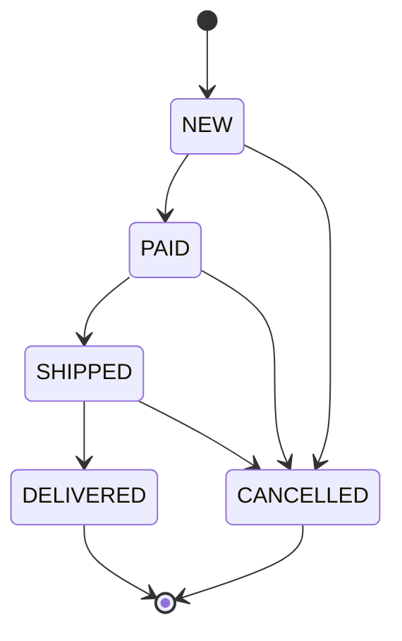

# Diagram stanów zamówienia

Diagram przedstawia wyłącznie przejścia zdefiniowane w `src/domain/orderStatus.ts`.

## Dozwolone przejścia

- `NEW` → `PAID`
- `NEW` → `CANCELLED`
- `PAID` → `SHIPPED`
- `PAID` → `CANCELLED`
- `SHIPPED` → `DELIVERED`
- `SHIPPED` → `CANCELLED`

Stany bez zdefiniowanych dalszych przejść: `DELIVERED` i `CANCELLED`.
