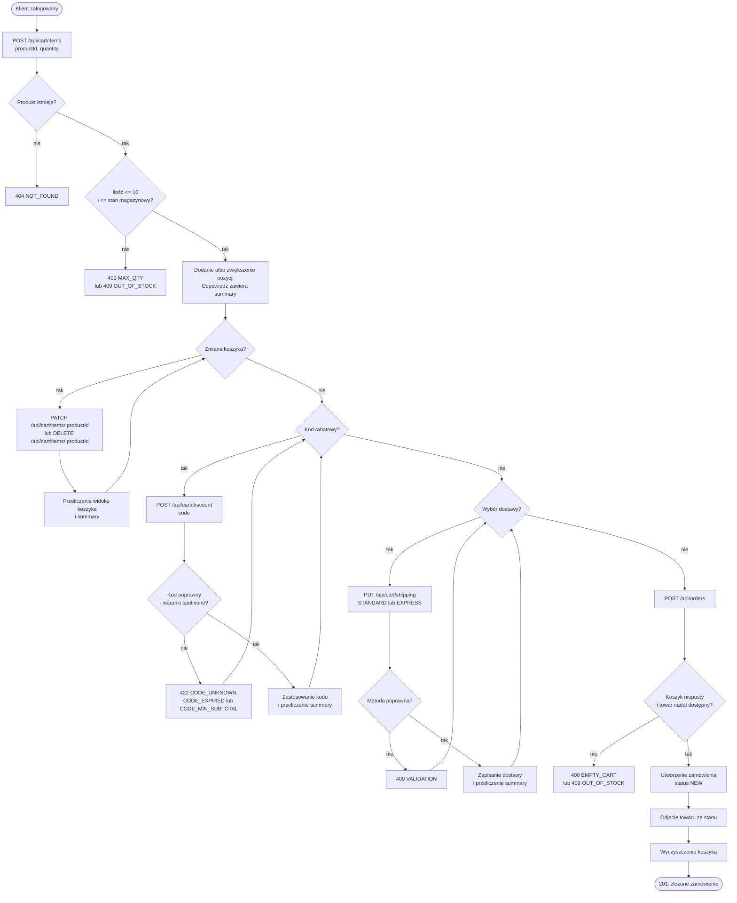

# Przepływ: od dodania produktu do złożenia zamówienia

Diagram obejmuje zalogowanego klienta. Endpointy koszyka wymagają uwierzytelnienia.

## Źródła

- `docs/architektura.md`, sekcja „Przepływ „złóż zamówienie””.
- `src/routes/cart.ts`: `cartRouter.post('/items')`, `cartRouter.patch('/items/:productId')`, `cartRouter.delete('/items/:productId')`, `cartRouter.post('/discount')`, `cartRouter.put('/shipping')`, `cartView`.
- `src/routes/orders.ts`: `ordersRouter.post('/')`.
